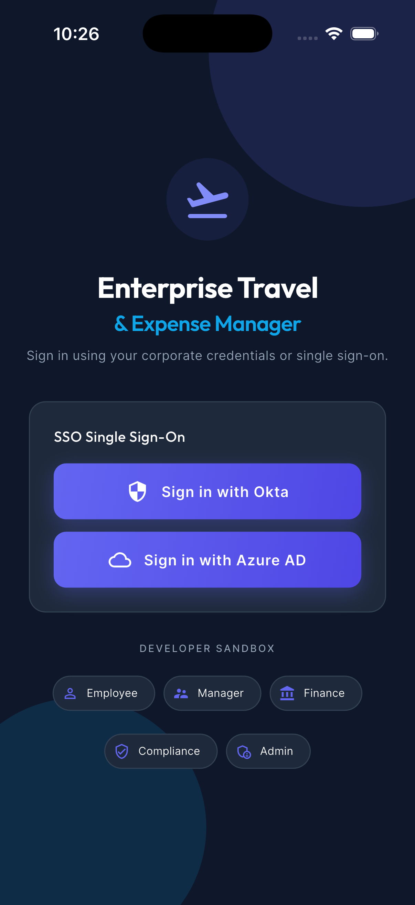
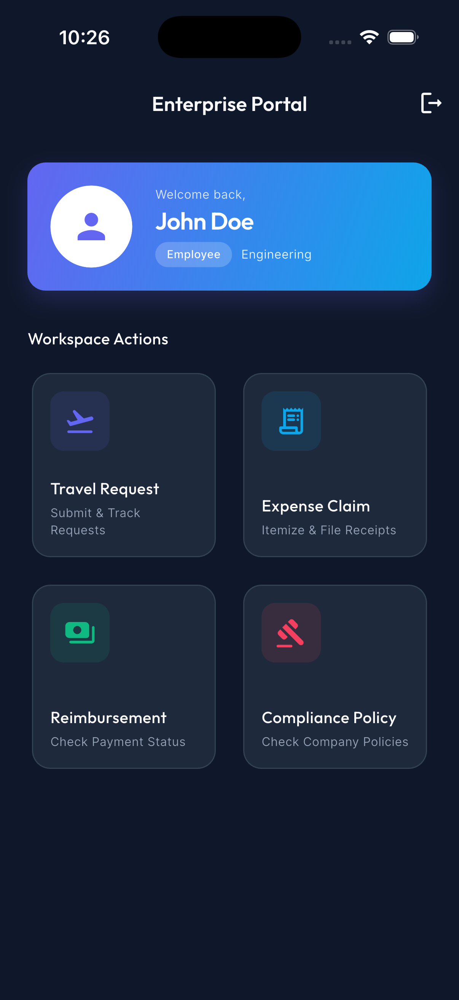
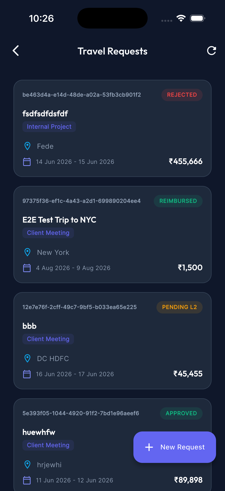
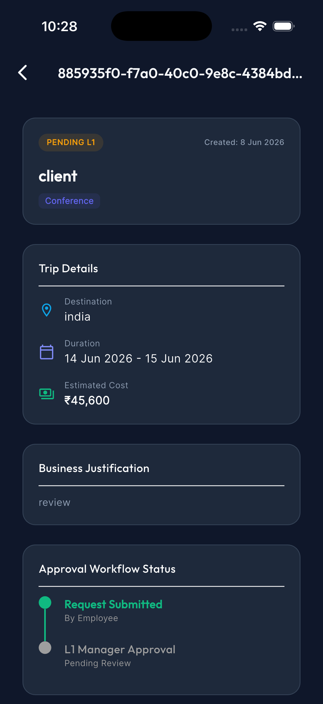
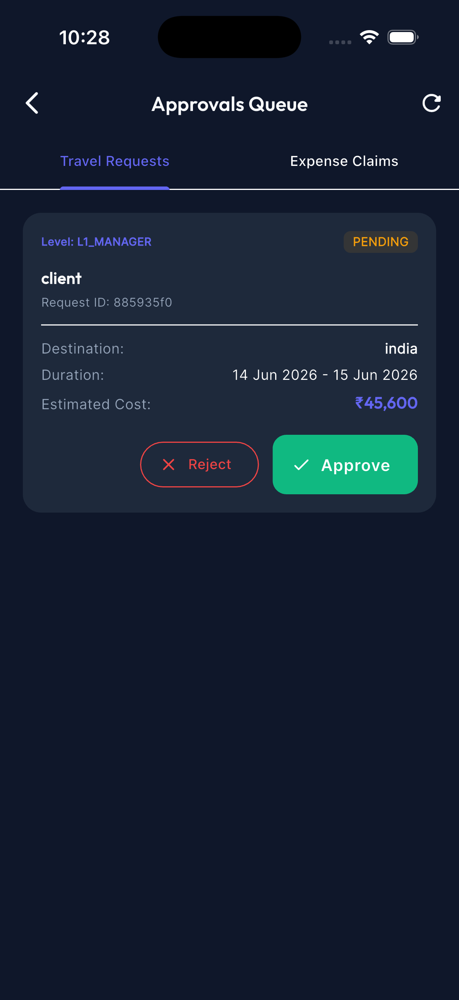

# Travel & Expense Tracker App (v1.0)

A modern, scalable Flutter application *(Version 1.0)* designed to handle end-to-end travel requests and expense reimbursements for corporate employees. 

## 📸 Screenshots

*(Images will display here once you save them to the `assets/screenshots/` directory)*

  
  
  
  
  

## 🚀 Current Status: Employee to Manager Flow

The core approval hierarchy has been thoroughly tested and is functioning perfectly. The current implemented flow represents the standard **Employee -> Manager** relationship:

1. **Travel Request Creation**: 
   - An `EMPLOYEE` submits a new Travel Request detailing the destination, dates, and estimated costs.
   - The system automatically enforces business rules (e.g., travel must be booked at least 7 days in advance).
2. **Manager Travel Approval**:
   - The Travel Request is placed into the `PENDING` queue for the `MANAGER`.
   - The Manager logs in, navigates to the **Approvals Queue** (Travel Requests tab), and can either Approve or Reject the request.
3. **Expense Claim Submission**:
   - Once the Travel Request is approved, the Employee can submit an **Expense Claim** against it.
   - The system validates that expenses are submitted within 30 days of the trip's end date.
   - The Expense Claim is routed to `PENDING_MANAGER` status.
4. **Manager Expense Approval**:
   - The Manager logs in and views the **Expense Claims** tab in the Approvals Queue.
   - The Manager reviews the total amounts and associated trips, and clicks **Approve & Forward to Finance**.

## 🔐 Authentication & Security Flow

This app uses a robust JSON Web Token (JWT) based authentication system, designed to seamlessly integrate with enterprise SSO providers.

**Authentication Flow:**
1. **Login Page**: Users are presented with Single Sign-On (SSO) options (e.g., Okta, Azure AD).
2. **Developer Sandbox**: For testing purposes, there is a built-in sandbox at the bottom of the login screen. Tapping a specific role (`Login as Employee`, `Login as Manager`) bypasses the SSO gateway and requests a mock JWT token directly from the backend.
3. **Token Storage**: Upon a successful response, the JWT token is securely stored on the device using `flutter_secure_storage`.
4. **API Interception**: All subsequent API requests made through `Dio` are intercepted, and the stored JWT is attached to the `Authorization: Bearer <token>` header.
5. **Backend Verification**: The NestJS backend verifies the JWT using passport-jwt, extracts the User ID and Role, and uses `RolesGuard` decorators to authorize access to specific endpoints.

## 👥 Roles & Future Features

The system architecture is designed around Role-Based Access Control (RBAC). While the Employee and Manager roles are currently implemented, the backend models are already configured for the following roles to unlock future features:

- **`EMPLOYEE`**: Can create travel requests, submit expense claims, and view their own history.
- **`MANAGER`**: Can approve Level-1 travel requests and expense claims submitted by their direct reports.
- **`DEPT_HEAD` (Future)**: Will approve Level-2 travel requests (e.g., International travel) and expense claims submitted by Managers.
- **`FINANCE` (Future Integration)**: 
  - Will manage the final queue of approved expense claims.
  - Will be responsible for changing the status from `PENDING_FINANCE` to `APPROVED` and finally to `PAID`.
  - Will have access to detailed reporting and payout exports.
- **`ADMIN` (Future Integration)**:
  - Will have access to the Audit Logs to track system anomalies or "Forbidden Resource" attempts.
  - Will manage user provisioning, role assignments, and global policy configurations (e.g., changing the 7-day advance booking rule).

## 🛠 Tech Stack

- **Frontend**: Flutter (Riverpod for state management, Dio for networking, clean architecture).
- **Backend**: NestJS (TypeScript, TypeORM, SQLite/Postgres).

---

## 🏗 Development Journey & Architecture Insights

### What We've Built So Far
We have successfully architected a highly scalable, offline-ready mobile client using **Flutter** and **Clean Architecture**. Our primary focus was establishing an unbreakable, end-to-end data flow spanning from the mobile device to the backend API.
- **State Management**: We implemented `Riverpod` to predictably manage complex, interdependent states (like combining Travel Requests with their respective Expense Claims).
- **Network Layer**: We engineered a custom `Dio` ApiClient featuring JWT interception, timeout management, and terminal logging for instant debugging.
- **Dependency Injection**: By leveraging `GetIt`, we decoupled our UI from our business logic. This ensures that scaling the app for future roles (Finance, Admin) will be practically plug-and-play.

### Difficulties & Bottlenecks Faced
Building an enterprise-grade Travel & Expense app is rarely a straight line. Here were the most notable hurdles we overcame:

1. **State Synchronization Across Distinct Data Models**: 
   * **The Bottleneck**: Originally, the Approvals Queue was designed solely for `ApprovalStageEntity` objects (Travel Requests). When we introduced Expense Claims (`ExpenseClaimEntity`), we risked creating a bloated, homogenous list that would inevitably crash due to parsing errors (`type Null is not a subtype of type List<dynamic> in type cast`).
   * **The Solution**: We refactored the UI to use a strict `DefaultTabController`. This allowed us to spin up parallel Riverpod state machines (`approvalsNotifierProvider` and `expenseApprovalsNotifierProvider`), isolating the data logic and preventing UI rendering exceptions.

2. **Role-Based Access Control (RBAC) Mismatches**: 
   * **The Bottleneck**: We faced several `403 Forbidden` exceptions during manual testing. The backend's strict `@RolesGuard` logic was originally hardcoded to skip the Manager and send Expense Claims directly to Finance. 
   * **The Solution**: We implemented dynamic backend routing so that if an `EMPLOYEE` submits a claim, it accurately routes to `PENDING_MANAGER`. We mapped this strictly to the Flutter UI so the Manager's token would successfully fetch the newly routed claims.

3. **Complex Form Validation & Deep Linking**:
   * **The Bottleneck**: Enforcing business logic (like "Travel must be booked 7 days in advance" and "Expenses claimed within 30 days") on both the client and server side. We didn't want the user to fill out a 20-field form just to get a cryptic `400 Bad Request` from the server.
   * **The Solution**: We pushed complex validation logic down to the Flutter UI layer, mapping specific error states directly to the input fields to give users immediate, context-aware feedback before the API call is even made.
